# TwitchMultiAccChat
### Python+Flask+IRC
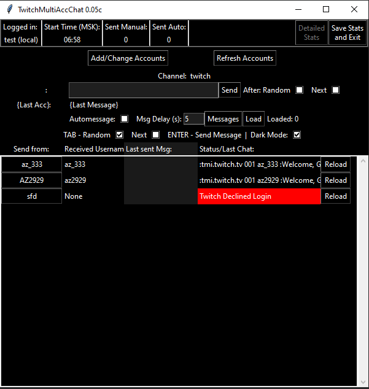
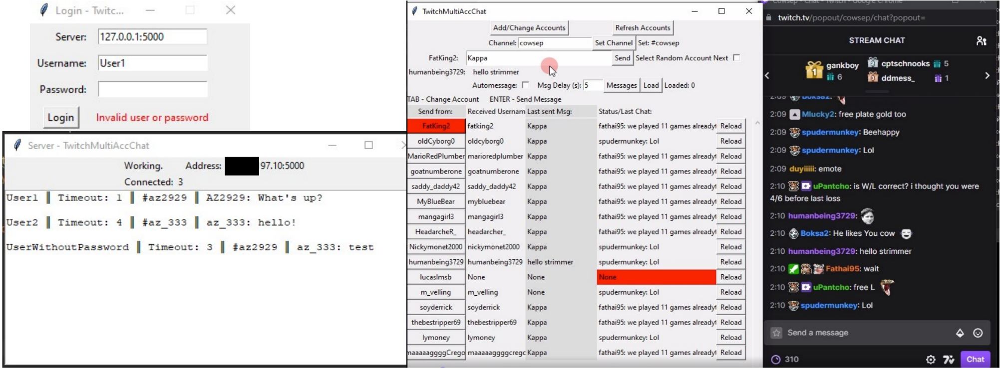
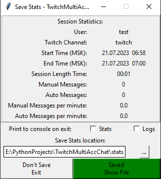

*Отправка сообщений в Twitch чат с десятков аккаунтов*

- Разработана для компании, предлагающей услуги накрутки пользователей Twitch чата
- Один оператор может работать одновременно с неограниченным количеством аккаунтов
- Хранение логов каждого оператора в БД серверной части, либо локальный экспорт в zip с паролем
- Возможность бана оператора, возможность получения Twitch аккаунтов с сервера
----------
# CoinPusherAsset
### LUA + Blender
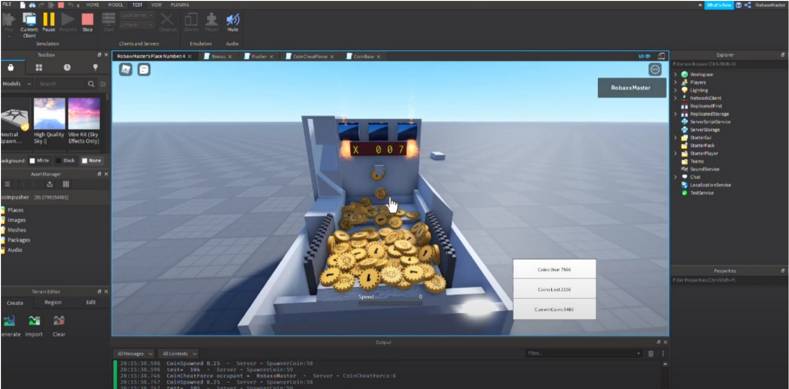

*Основа, физика и логика автомата для игры “Coin Pusher” в Roblox*

Видео-демонстрация: [https://www.youtube.com/watch?v=biIpVbpUSwg](https://www.youtube.com/watch?v=biIpVbpUSwg)

- Разработана для большего проекта
- Разные режимы, бонусы. Адаптивная сложность
- Коммуникация с сервером, для хранения результатов
- Передача физики монет между клиентами и сервером
------------
# ChatGPTxDeepL
### Python + Selenium / Undetected Chromedriver
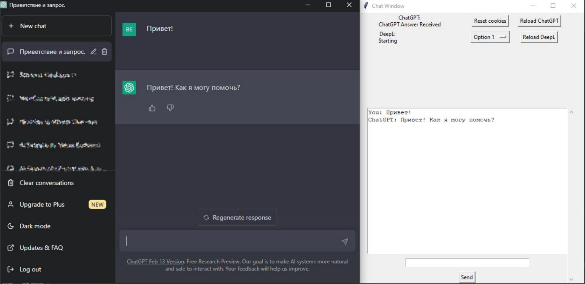

*Парсер, псевдо-API для автоматизированной работы с ChatGPT без аккаунта, встроенный переводчик DeepL*

Код: [https://github.com/AZ777xx/ChatGPTWebTranslate](https://github.com/AZ777xx/ChatGPTWebTranslate)

- Разработана как библиотека, для дальнейшей интеграции в чат-боты (например Telegram)
- Работает без API на бесплатных аккаунтах ChatGPT
- Возможность перевода ввода/вывода на все доступные в DeepL языки
- Распознание нештатных ситуация, и ошибок ChatGPT
------------
# LFSCounterSteerFFB
### Python + XInput + ViGEmBus
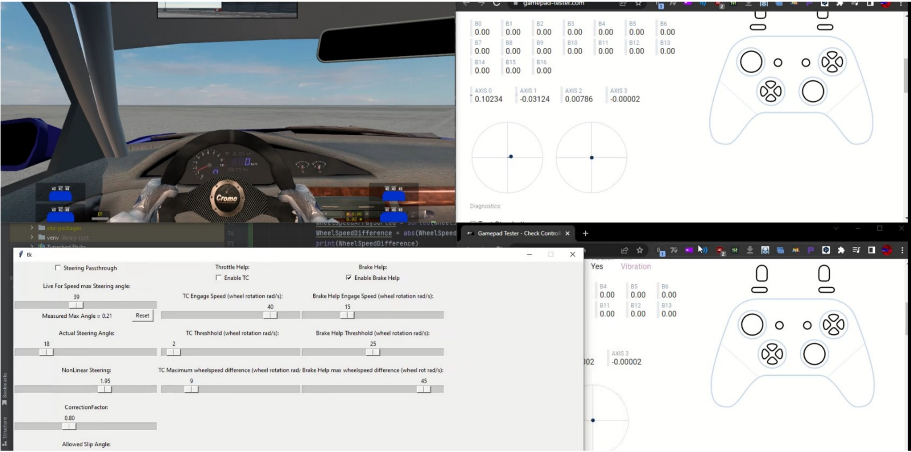

*Чит, помощник управления (Stability Control, TC, ABS) для гоночного симулятора Live For Speed*

Код: [https://github.com/AZ777xx/CountersteerLFS](https://github.com/AZ777xx/CountersteerLFS)

- Выгрузка состояния автомобиля через протокол “OutSim” (обычно используется для Full Motion Simulator)
- Undetected: Изменение поведения автомобиля, путём создания виртуального Xbox геймпада и привязки управле-
ния к нему
- Расчёт угла сноса задней оси, корректировка руля
- Traction Control и ABS путём изменения состояния газа и тормоза
- Система настроек и профилей (например, под разные автомобили или трассы)
---------------
# TrueRealisticDrivingV
### C++ + Script Hook V

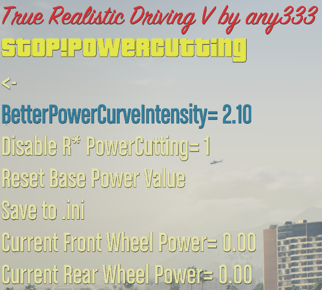

*Набор модов для реалистичного поведения автомобился в игре GTA V*

- __True Realistic Driving V__ - GTA не берёт в расчёт массу автомобиля при вычислении физики. Данный мод добавляет силы инерции, основываясь на массе
- __Stop!Powercutting__ - GTA урезает мощность двигателя при пробуксовке - данный мод вычисляет и возврашает потерянную мощность
- __True Smoke V__ - Генерация дополнительных эффектов дыма
- __ManualTransmission__ - Разработал и внедрил дифференциал ограниченного проскальзывания

Официальная страница: [https://www.gta5-mods.com/scripts/true-realistic-driving-v-realistic-mass-v0-1-beta](https://www.gta5-mods.com/scripts/true-realistic-driving-v-realistic-mass-v0-1-beta)

------------------
# YM-Excel-Tools
### VBA
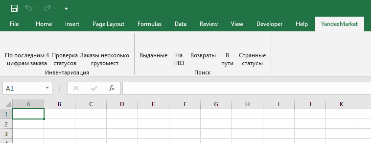
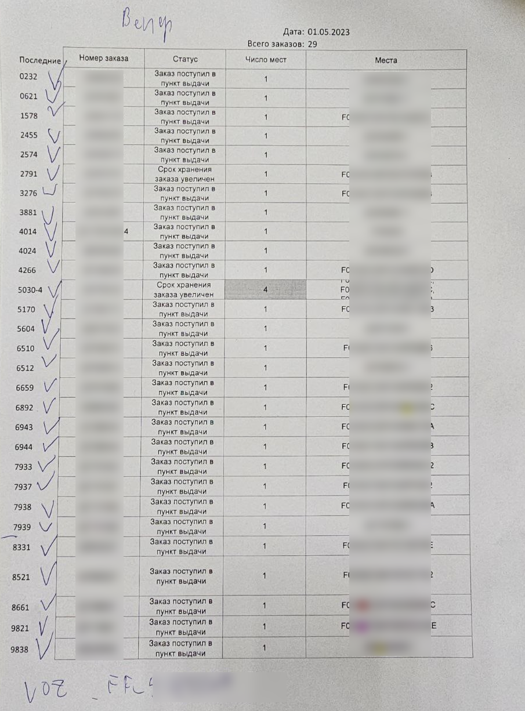

*Расширение с набором функций для работы с файлом заказов, выгруженным из личного кабинета ПВЗ Яндекс Маркет*

- __Основной функционал__ - Поиск заказов по категориям и форматирование для печати
- Выборка заказов, форматирование для печати, добавление даты, количества заказов, выделение полей и сортировка инвентаризации под требования склада заказчика
-------------
# Google-Ozon-YM-Sync
### Python + Google Api, Ozon Api, Yandex Api
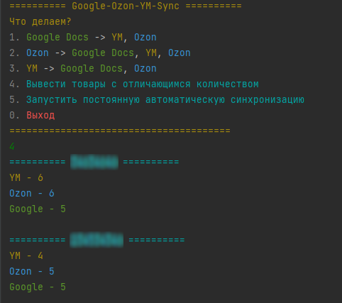
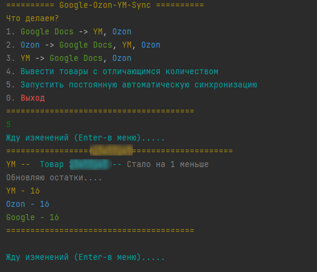

*Скрипт,синхронизирующий остатки товара магазина на Озон и Яндекс Маркет*

- Написан для магазина, ведущего инвентарь в Гугл таблицах
- Поддерживает ручную синхронизацию остатков, а так же постоянную автоматическую работу
- Развёрнутые логи в текстовом файле
-------------
# GooglePhoneParser
### Python + Selenium
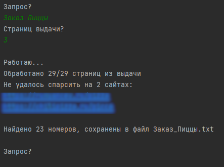

*Скрипт, собирающий телефонные номера с сайтов по определённому запросу в Гугл*

- Распознание номеров во всех местах сайта, включая нестандартные форматировки

<!-- # plc web # duplicate photo finder -->